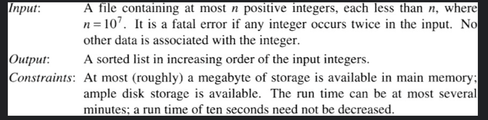
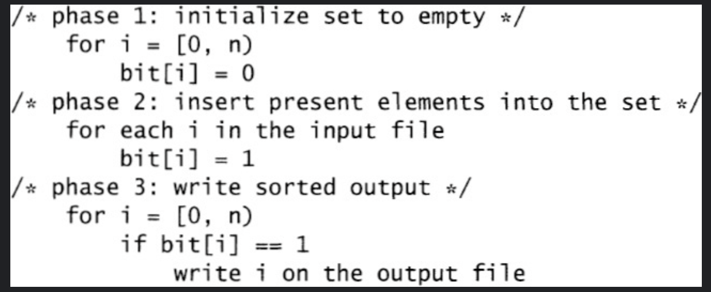

## Cracking the Oyster

### before start....

* Merge Sort
  * Both merge sort and quicksort employ a common algorithmic paradigm based on recursion. This paradigm, divide-and-conquer, **breaks a problem into subproblems** that are similar to the original problem, recursively solves the subproblems, and finally combines the solutions to the subproblems to solve the original problem.

### Cracking the Oyster

* Question - How do I sort a disk file?
  * Friendly Conversation
    1. 왜 시스템이 제공하는 정렬을 사용하지않니?
       * 큰 시스템을 정렬하기위해, 기술적 이유로 제공하는 정렬 사용하지않음
    2. 정확히 무엇을 정렬하고 있습니까? 파일에 몇 개의 레코드가 있습니까? 각 레코드의 형식은 무엇입니까?
       * 파일에는 최대 천만 개의 레코드가 포함되어 있습니다. 각 레코드는 7자리 정수입니다.
    3. 파일이 그렇게 작은 경우 왜 메인 메모리에서 정렬하지 않습니까?
       *  시스템자체가 큰 시스템이므로 (?)
    4. 더 알아야할 것들?
       * 각각의 데이터는 7자리 양의 정수이며 같은 정수는 두 번 이상 나타날 수 없습니다.
       

* toll-free (수신자 부담 전화)

* Problem
  * The programmer was building a small corner of a system for processing such a database, and the integers to be sorted were toll-free telephone numbers.  
  *   
  * 문제 : 한정된 메모리를 활용하여 파일을 읽어들여 정렬 후 다시 디스크에 쓰는 함수 작성하여야 함
  * 입력 : 최대 n개의 양의 정수를 포함하는 파일로, 각 숫자는 n보다 작고, n= 10^7임. 중복 없음. 정수만 존재
  * 출력 : 입력된 정수를 오름차순으로 정렬한 리스트
  * 제약사항 : 메모리 1MB만 사용 가능함. 디스크 공간은 충분, 10초~2분 실행시간 안에 완료 되어야 함
  
* Program Design
  1. The obvious program uses a general disk-based Merge Sort as a starting point but trims it to exploit the fact that we are sorting integers. That reduces the two hundred lines of code by a few dozen lines, and also makes it run faster. It might still take a few days to get the code up and running.
  2. 1MB = 1000kb = 1000000byte   그래서 약 143000 (100만 / 7바이트) 을 1MB에 저장이 가능하다  
     하지만 각 숫자를 32비트 정수로 나타내면 메가바이트에 250,000개의 숫자를 저장할 수 있습니다. (4바이트)
     즉 25만 * 40 -> 1000만 이므로 40번 반복하면된다(?)
  3. 세 가지 풀이법이 제공되는 것으로 보여짐 (?)
     1. Merge-sort Program - 파일을 한번 읽고, 여러번 읽고 쓰고(?) 마지막 출력파일에 쓴다.
     2. 40-pass algorithms - 파일을 여러번 읽고 결과를 한번에 write한다. 
     3. 1,2의 장점을 결합한 3번 방식을 원한다. 입력을 한 번만 읽고 중간 파일을 사용하지 않는 방식. -> 적절한 방식을 생각하시오.
  
 

* Implementation Sketch (구현 스케치)
  1. set {1, 2, 3, 5, 8, 13}  
     0 1 1 1 0 1 0 0 1 0 0 0 0 1 0 0 0 0 0 0 
       
  2. 7자리 정수는 1000만보다 작다
  3. 파일의 정수 집합을 나타내는 비트맵 데이터 구조가 주어지면 프로그램은 세 가지 자연스러운 단계로 작성될 수 있습니다. 
  첫 번째 단계에서는 모든 비트를 꺼서 세트를 비어 있도록 초기화합니다.
  두 번째 단계에서는 파일의 각 정수를 읽고 적절한 비트를 켜서 set을 빌드합니다.
  세 번째 단계는 각 비트를 검사하고 비트가 1인 경우 적절한 정수를 작성하여 정렬된 출력 파일을 생성합니다.
     
* Principles (원리)
  1. 문제 파악 (올바르게 파악했는가) - 문제 10,11,12 참고
  2. 비트맵 데이터 구조(?) - 문제 6,8
  3. 다중 패스 알고리즘 - 문제 5
  4. 시간과 공간의 Tradeoff - 시간을 더 사용하면 적은 공간 활용으로 가능하다
  5. Simple한 프로그래밍 디자인

* 결론
  * 작은 문제를 주의 깊게 분석하면 때때로 엄청난 실질적인 이점을 얻을 수 있다
  * 풀이는 **정수의 존재 자체를 hashtable에 만들어서 사용한다는것**
  * 1000000 byte -> 8000000 bit 이므로, 2번의 disk access 를 통하여 가능
  
* My Opinion
  * 예전에 알고리즘 공부할떄 dp(dynamic programming) 로 해결가능하지않을까?
    * dp가아닌 map에저장하는형식??
  * 어차피 만약 count숫자가 2인 경우는 fatal error 로 체크하면될듯??

* Problem
  1. 메모리가 부족하지 않다면 집합을 표현하고 정렬하기 위한 라이브러리가 있는 언어에서 정렬을 어떻게 구현하겠습니까?
    * just use sort
  2. 비트 논리 연산(예: and, or 및 shift)을 사용하여 비트 벡터를 구현하는 방법
    * https://www.programiz.com/kotlin-programming/bitwise in kotlin
    * 비트 백터 - 코틀린으로 BitSet을 이용하여 구현한다.
  3. 런타임 효율성은 설계 목표의 중요한 부분이었고 결과 프로그램은 충분히 효율적이었습니다. 
  시스템에서 비트맵 정렬을 구현하고 실행 시간을 측정하십시오. 
  시스템 정렬 및 문제 1의 정렬과 어떻게 비교됩니까? 
  n이 10,000,000이고 입력 파일에 1,000,000개의 정수가 포함되어 있다고 가정합니다.
     * 제대로한지 모르겠지만, 10배정도 차이가나는거같음..? [problem03](/study/section01/problem3/RuntimeEfficient.kt)
  
  4. d
  5. d

### Todo

1. Tim Sort란?

### Homework
* 220307
1. bitset직접 만들어보기.. -> 그리고 시간 재보기. (신짱은 파이선 속도가 왜 더 느린지 알아오기)
2. 문제 2번 풀이 헤석
3. 시간남으면 4~5번까지 풀어보기.

### 참고자료
  * gitignore - https://stackoverflow.com/questions/29386242/android-studio-gitignore-wont-ignore-iml
  * 다른분 해설 - https://fist0512.tistory.com/139

